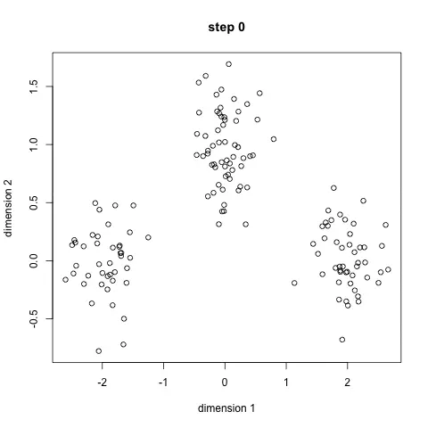

# 无监督学习/Unsupervised Learning

**Reference Link**: https://zhuanlan.zhihu.com/p/62075440
---

## 概念
无监督学习是机器学习的训练方式，本质上是一个统计手段，在没有标签的数据中发现潜在的一些结构的一种训练方式。例如聚类算法，实际应用中有google网站的新闻分组，基因序列分组。

三个特点：
1. 没有明确的目的
2. 不需要给数据打标签
3. 无法量化效果

对比监督学习：
1. 监督学习是一种目的明确的训练方式，你知道得到的是什么；而无监督学习则是没有明确目的的训练方式，你无法提前知道结果是什么。
2. 监督学习需要给数据打标签；而无监督学习不需要给数据打标签。
3. 监督学习由于目标明确，所以可以衡量效果；而无监督学习几乎无法量化效果如何。

## 场景
### 发现异常
通过无监督学习，我们可以快速把行为进行分类，虽然我们不知道这些分类意味着什么，但是通过这种分类，可以快速排出正常的用户，更有针对性的对异常行为进行深入分析。

### 用户分析
这个对于广告平台很有意义，我们不仅把用户按照性别、年龄、地理位置等维度进行用户细分，还可以通过用户行为对用户进行分类。

通过很多维度的用户细分，广告投放可以更有针对性，效果也会更好。

### 推荐系统
根据用户的购买行为来推荐相关的商品的一个例子。

比如大家在淘宝、天猫、京东上逛的时候，总会根据你的浏览行为推荐一些相关的商品，有些商品就是无监督学习通过聚类来推荐出来的。系统会发现一些购买行为相似的用户，推荐这类用户最"喜欢"的商品。

## 算法
聚类：简单说就是一种自动分类的方法，在监督学习中，你很清楚每一个分类是什么，但是聚类则不是，你并不清楚聚类后的几个分类每个代表什么意思。

降维：降维看上去很像压缩。这是为了在尽可能保存相关的结构的同时降低数据的复杂度。

### 聚类
#### 聚类算法：K均值聚类
K均值聚类就是制定分组的数量为K，自动进行分组。

K 均值聚类的步骤如下：

1. 定义 K 个重心。一开始这些重心是随机的（也有一些更加有效的用于初始化重心的算法）
2. 寻找最近的重心并且更新聚类分配。将每个数据点都分配给这 K 个聚类中的一个。每个数据点都被分配给离它们最近的重心的聚类。这里的「接近程度」的度量是一个超参数——通常是欧几里得距离（Euclidean distance）。
3. 将重心移动到它们的聚类的中心。每个聚类的重心的新位置是通过计算该聚类中所有数据点的平均位置得到的。
重复第 2 和 3 步，直到每次迭代时重心的位置不再显著变化（即直到该算法收敛）。

#### 聚类算法： 层次聚类

如果你不知道应该分为几类，那么层次聚类就比较适合了。层次聚类会构建一个多层嵌套的分类，类似一个树状结构。
层次聚类的步骤如下：

1. 首先从 N 个聚类开始，每个数据点一个聚类。
2. 将彼此靠得最近的两个聚类融合为一个。现在你有 N-1 个聚类。
3. 重新计算这些聚类之间的距离。
4. 重复第 2 和 3 步，直到你得到包含 N 个数据点的一个聚类。
5. 选择一个聚类数量，然后在这个树状图中划一条水平线。

### 降维

#### 降维算法： 主成分分析 - PCA
主成分分析是把多指标转化为少数几个综合指标。
主成分分析经常用减少数据集的维数， 同时保持数据集的对方差贡献最大的特征。 这是通过保留低阶主成分，忽略高阶主成分做到的。 这样低阶成分能够保留住数据的最重要方面。
变换的步骤：

第一步计算矩阵 X 的样本的协方差矩阵 S（此为不标准PCA，标准PCA计算相关系数矩阵C）
第二步计算协方差矩阵S（或C）的特征向量e1,e2,…,eN和特征值 , t = 1,2,…,N
第三步投影数据到特征向量张成的空间之中。利用下面公式，其中BV值是原样本中对应维度的值。

#### 降维算法：奇异值分解 - SVD
奇异值分解（Singular Value Decomposition）是线性代数中一种重要的矩阵分解，奇异值分解则是特征分解在任意矩阵上的推广。在信号处理、统计学等领域有重要应用。

